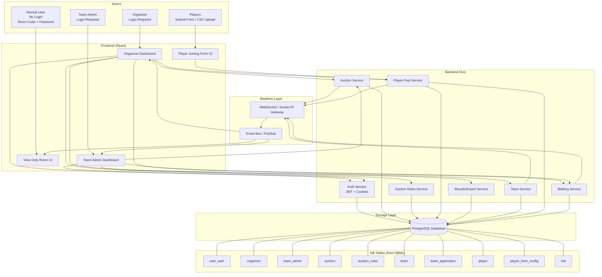

# Auction Platform

This system is designed to support a **real-time player auction platform** where multiple actors interact under controlled permissions.

The platform supports:
- **Organizer login** for auction creation, rules setup, player pool management, and auction control  
- **Team Admin login** for team registration, room application, and real-time bidding  
- **Normal users (view-only)** joining via **Room Code + Password** without authentication  
- **Players** joining through a dynamic form or CSV upload before the auction goes live  
- **Real-time bid broadcasting** using **WebSockets** to keep all clients synchronized  
- A centralized **PostgreSQL database** storing auctions, teams, bids, players, and results  

The system is split into **Frontend**, **Backend Services**, **Real-time Communication Layer**, and **Storage**, ensuring scalability and clear separation of responsibilities.

# Architecture Diagram (High-Level)

# Permission Matrix (RBAC)

The system will use **Role-Based Access Control (RBAC)** with 3 major access categories:

- **Organizer** (full control of auction lifecycle)
- **Team Admin** (bidding + team management)
- **Unauthenticated Users** (players/guests: view-only + form submission)

  
| Permission | Organizer | Team Admin | Unauth (Players/Guest) | Notes |
|-----------|-----------|------------|-------------------------|------|
| `auction:create` | ✅ | ❌ | ❌ | Organizer creates bidding room |
| `auction:view` | ✅ | ✅ | ✅ | Everyone can view auction details |
| `auction:update` | ✅ | ❌ | ❌ | Organizer updates auction info |
| `auction:start` | ✅ | ❌ | ❌ | Only Organizer starts auction |
| `auction:end` | ✅ | ❌ | ❌ | Only Organizer ends auction |
| `auction_rules:view` | ✅ | ✅ | ✅ | Everyone can view rules |
| `auction_rules:update` | ✅ | ❌ | ❌ | Only Organizer edits rules |
| `team:apply` | ❌ | ✅ | ❌ | Team Admin applies to join room |
| `team:approve` | ✅ | ❌ | ❌ | Organizer approves team |
| `team:reject` | ✅ | ❌ | ❌ | Organizer rejects team |
| `team:view` | ✅ | ✅ | ❌ | Team Admin can view own team only |
| `team:update_budget` | ❌ | ✅ | ❌ | Team Admin updates team budget |
| `player:create` | ✅ | ❌ | ✅ | Unauth users can submit players |
| `player:update` | ✅ | ❌ | ✅ | Allowed until pool is locked |
| `player:view` | ✅ | ✅ | ✅ | Everyone can view pool |
| `player:submit` | ❌ | ❌ | ✅ | Players can submit via form |
| `player_form:view` | ✅ | ✅ | ✅ | Everyone can view player form |
| `player_form:update` | ✅ | ❌ | ❌ | Organizer updates form schema |
| `player_form:lock` | ✅ | ❌ | ❌ | Organizer locks form before LIVE |
| `bid:place` | ❌ | ✅ | ❌ | Only Team Admin can bid |
| `bid:view` | ✅ | ✅ | ✅ | Everyone can view bid activity |

# Core Flows (Auction lifecycle, bidding flow)

This section describes the **end-to-end lifecycle** of an auction room, including team onboarding, player pool management, and real-time bidding.

## Auction Lifecycle Flow (Organizer Controlled)

### **Step 1: Auction Creation**
- Organizer logs in.
- Organizer creates a new auction room.
- System generates:
  - `room_code`
  - `room_password`
- Auction is created in `DRAFT` state.

**DB Tables involved**
- `auction`
- `auction_rules`

### **Step 2: Configure Auction Rules**
Organizer defines rules such as:
- minimum bid
- bid increments
- max players per team
- budget constraints

Once configured, rules are saved and visible to all participants.

**DB Tables involved**
- `auction_rules`

### **Step 3: Player Pool Setup**
Players can be added before auction goes live in two ways:
- Organizer uploads CSV file
- Players submit player form (public access)

Players are added into the auction pool with status:

- `IN_POOL`

Organizer can still edit player details while auction is in `DRAFT`.

**DB Tables involved**
- `player`
- `player_form_config`

### **Step 4: Team Applications**
- Team Admin logs in.
- Team Admin creates team profile.
- Team Admin applies to join auction.

Organizer reviews team applications and either:
- approves
- rejects

Once approved:
- team status becomes `APPROVED`
- team budget becomes locked

**DB Tables involved**
- `team_application`
- `team`

### **Step 5: Auction Start**
Organizer starts the auction.

System transitions auction state:
- `DRAFT → LIVE`

Once auction becomes LIVE:
- player form is locked
- player pool is locked
- no new teams can apply
- no new players can be added

**DB Tables involved**
- `auction`
- `player_form_config`

### **Step 6: Auction End**
Organizer ends the auction.

System transitions auction state:
- `LIVE → ENDED`

Final results are generated:
- team rosters
- sold player list
- final budgets
- exportable CSV report

**DB Tables involved**
- `auction`
- `player`
- `team`

## Player Form Submission Flow (Unauthenticated Users)

This flow supports public player registration similar to Google Forms.

### **Steps**
1. Unauthenticated user opens player form using `room_code`.
2. User submits player details.
3. System validates:
   - auction exists
   - auction status is `DRAFT`
   - form is not locked
4. Player entry is created with:
   - `status = IN_POOL`
   - `team_id = NULL`

If auction is LIVE, submission is rejected.

**DB Tables involved**
- `player`
- `player_form_config`

## Real-Time Bidding Flow (Team Admin + Organizer)

### **Step 1: Organizer Selects Player**
Organizer selects a player from the pool.

System validates:
- auction status must be `LIVE`
- player must be `IN_POOL`

System broadcasts selected player event via WebSocket.

### **Step 2: Team Admin Places Bid**
Team Admin submits bid request.

System validates:
- team is `APPROVED`
- auction is `LIVE`
- bid amount follows increment rule
- bid amount <= remaining team budget
- player is still active and unsold

Bid is persisted and broadcasted.

**DB Tables involved**
- `bid`
- `team`

### **Step 3: Bid Winner Finalization**
Organizer finalizes the winning bid.

System updates:
- player status: `SOLD`
- player final_price
- player team_id assigned to winning team
- team remaining_budget deducted

System broadcasts:
- winning team
- final price
- updated team budget
- updated pool state

**DB Tables involved**
- `player`
- `team`
- `bid`

### **Step 4: Unsold / Skip Logic**
Organizer can mark player as:
- `UNSOLD` (no valid bids)
- or skip player for rebidding later

System updates player state accordingly.

**DB Tables involved**
- `player`

## View-Only Audience Flow (No Login)

Normal users can join using:
- Room Code
- Room Password

They can view:
- teams
- player pool
- current player
- current highest bid
- auction status
- final results

They cannot:
- bid
- edit players
- create teams

System streams live updates via WebSocket.

## Concurrency Handling (Bid Race Conditions)

Since multiple teams can bid at the same time, bid placement requires concurrency control.

### Strategies Supported
- **Optimistic locking** using `team.version`
- OR **row-level locking** using DB transactions (`SELECT ... FOR UPDATE`)

Validation ensures:
- remaining budget never becomes negative
- only one winning bid is finalized per player

## State Transition Summary

| Auction Status | Allowed Actions |
|--------------|-----------------|
| `DRAFT` | Add/edit players, team applications, update rules |
| `LIVE` | Place bids, finalize winners, broadcast events |
| `ENDED` | View results, export CSV |

# Concurrency / Bid locking strategy
(WIP)
